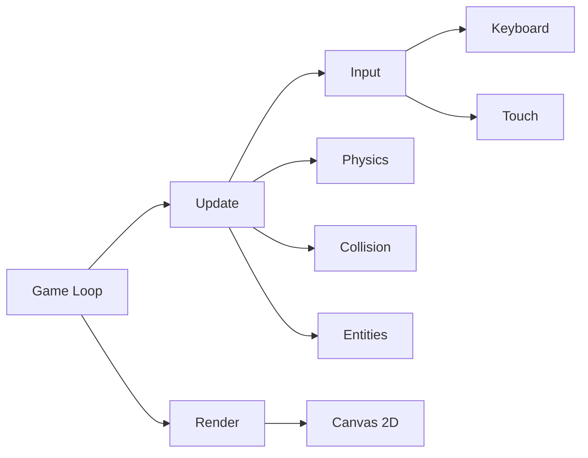
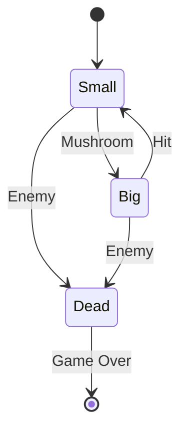
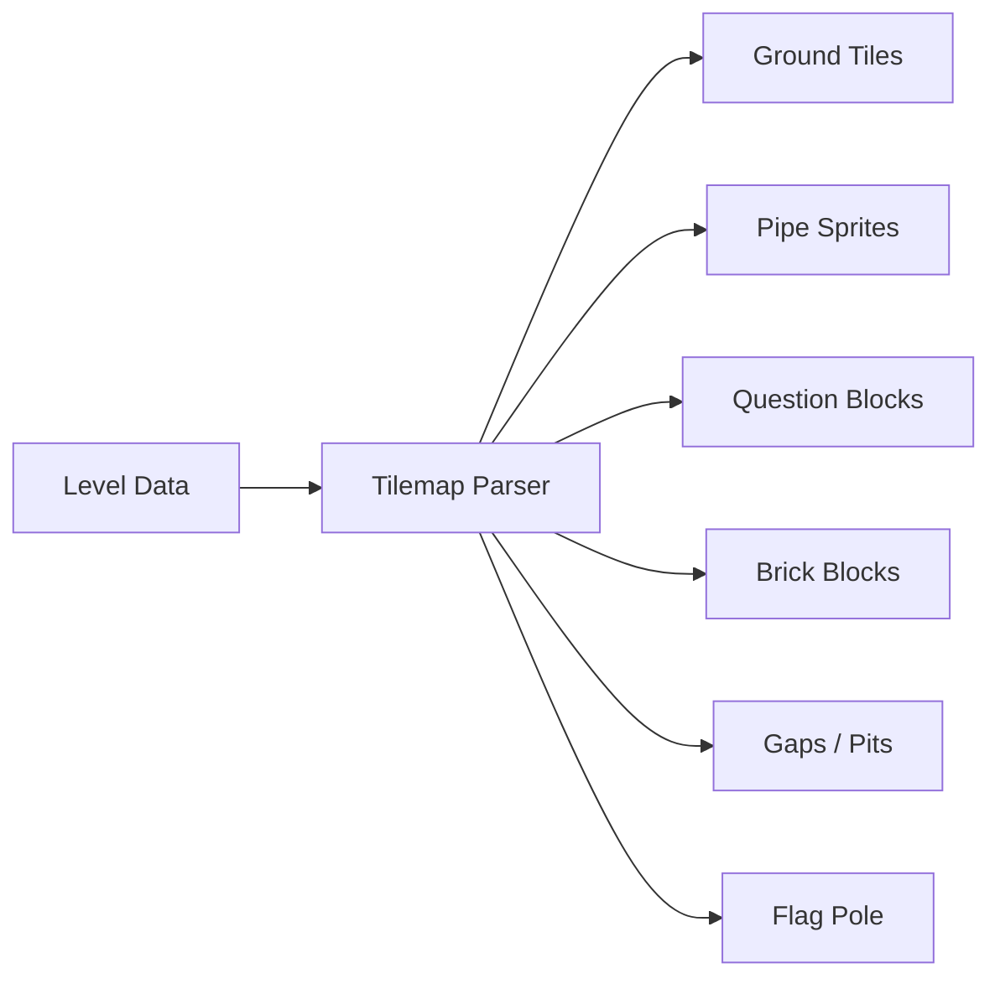
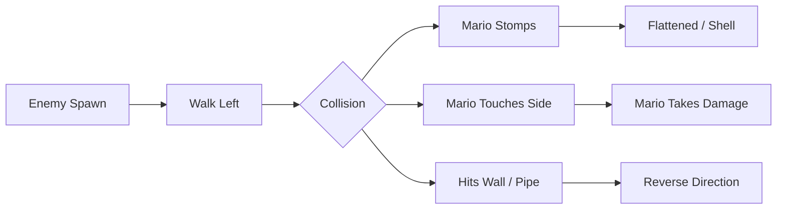
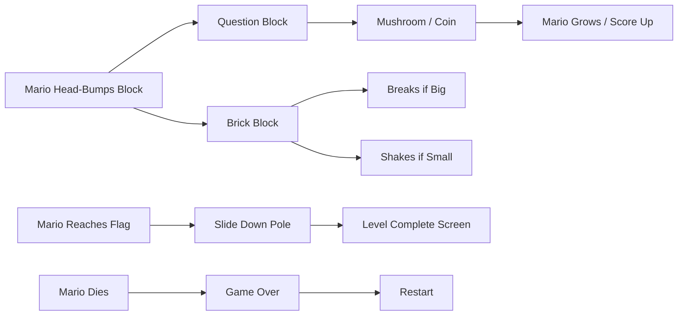
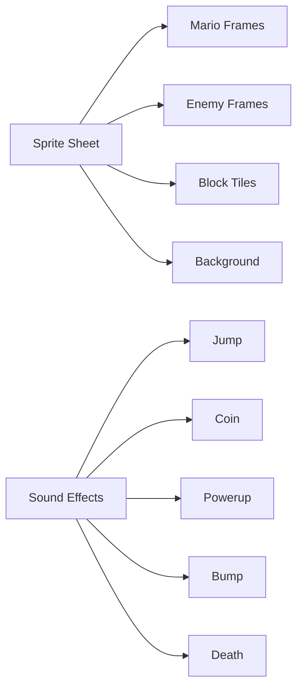

# Super Mario Bros World 1-1 Clone

## Core Problem

Build a playable HTML/JS clone of SMB1 World 1-1 in the html-game project alongside Galaga

## Goal

Playable level 1-1 with Mario physics, enemies, blocks, pipes, flag pole, scoring, and game-over/restart

---

## 1. Engine

- **Pattern:** Game Loop + Component-Based Entity

**Objective:** Core game loop, canvas rendering, input handling, and entity system

**Success Criteria:** Game loop running at 60fps, input responsive, entities can be spawned and rendered



### 1.1. Canvas setup and game loop

**Type:** feature

**What:** Create index.html with canvas and main.js with requestAnimationFrame game loop

**Why:** Foundation for all rendering and game logic

**Files:**

- + smb1/index.html
- + smb1/js/main.js

**Snippet:**

```
const canvas = document.getElementById('game');
const ctx = canvas.getContext('2d');
canvas.width = 800;
canvas.height = 480;

let lastTime = 0;
function gameLoop(timestamp) {
    const dt = (timestamp - lastTime) / 1000;
    lastTime = timestamp;
    update(dt);
    render();
    requestAnimationFrame(gameLoop);
}
requestAnimationFrame(gameLoop);
```

**Acceptance Criteria:**

- [ ] Canvas renders at 800x480
- [ ] Game loop runs at 60fps with delta time

**Verify:**

```bash
open ~/src/html-game/smb1/index.html
```

### 1.2. Input handling and camera system

**Type:** feature

**What:** Add keyboard input manager (Arrow keys + Z/X) and scrolling camera that follows Mario

**Why:** Player needs controls and the level needs to scroll horizontally

**Files:**

- + smb1/js/input.js
- + smb1/js/camera.js

**Snippet:**

```
const keys = {};
window.addEventListener('keydown', e => keys[e.code] = true);
window.addEventListener('keyup', e => keys[e.code] = false);

// Camera follows Mario with clamping
class Camera {
    update(playerX, levelWidth) {
        this.x = Math.max(0, Math.min(playerX - 300, levelWidth - 800));
    }
}
```

**Acceptance Criteria:**

- [ ] Arrow keys tracked in real-time
- [ ] Camera follows player and clamps to level bounds

**Verify:**

```bash
open ~/src/html-game/smb1/index.html
```

### 1.3. Entity base class and sprite system

**Type:** feature

**What:** Create base Entity class with position, velocity, and sprite rendering via pixel art tilemap

**Why:** All game objects (Mario, enemies, blocks) share common behavior

**Files:**

- + smb1/js/entity.js
- + smb1/assets/sprites.png
- + smb1/js/sprites.js

**Snippet:**

```
class Entity {
    constructor(x, y, w, h) {
        this.x = x; this.y = y;
        this.w = w; this.h = h;
        this.vx = 0; this.vy = 0;
        this.alive = true;
    }
    update(dt) {}
    render(ctx, camera) {
        ctx.drawImage(spriteSheet, sx, sy, sw, sh,
            this.x - camera.x, this.y, this.w, this.h);
    }
}
```

**Acceptance Criteria:**

- [ ] Sprite sheet loaded and sub-images can be extracted
- [ ] Entity can be positioned and rendered relative to camera

**Verify:**

```bash
open ~/src/html-game/smb1/index.html
```

---

## 2. Mario

- **Pattern:** State Machine + Physics Body

**Objective:** Mario character with movement, jumping, gravity, big/m small states, and death animation

**Success Criteria:** Mario runs, jumps, grows with mushroom, and dies on enemy contact



### 2.1. Mario physics and movement

**Type:** feature

**What:** Implement Mario with gravity, acceleration, max speed, and variable-height jumping

**Why:** Mario needs authentic platforming feel — snappy controls with momentum

**Files:**

- + smb1/js/mario.js

**Snippet:**

```
class Mario extends Entity {
    constructor(x, y) {
        super(x, y, 16, 16);
        this.state = 'small';
        this.speed = 200;
        this.accel = 1200;
        this.gravity = 1500;
        this.jumpVel = -400;
        this.onGround = false;
    }
    update(dt) {
        if (keys['ArrowRight']) this.vx += this.accel * dt;
        if (keys['ArrowLeft']) this.vx -= this.accel * dt;
        this.vy += this.gravity * dt;
        this.x += this.vx * dt;
        this.y += this.vy * dt;
    }
}
```

**Acceptance Criteria:**

- [ ] Mario accelerates and decelerates smoothly
- [ ] Mario falls with gravity when off ground
- [ ] Speed caps at max (200 px/s)

**Verify:**

```bash
open ~/src/html-game/smb1/index.html
```

### 2.2. Mario jumping and states

**Type:** feature

**What:** Add variable-height jumping, big/small states, mushroom powerup, and death/invincibility

**Why:** Iconic SMB mechanics — short tap = short hop, hold = full jump, states affect collision

**Files:**

- ~ smb1/js/mario.js

**Snippet:**

```
jump() {
    if (!this.onGround) return;
    this.vy = this.jumpVel;
    this.onGround = false;
}
// Release jump early = cut velocity
update(dt) {
    if (!keys['ArrowUp'] && this.vy < -100) this.vy = -100;
}
grow() {
    if (this.state === 'small') {
        this.state = 'big'; this.h = 32; this.y -= 16;
    }
}
shrink() {
    if (this.state === 'big') {
        this.state = 'small'; this.h = 16; this.invulnerable = true;
        setTimeout(() => this.invulnerable = false, 2000);
    }
}
```

**Acceptance Criteria:**

- [ ] Short tap of jump = small hop
- [ ] Hold jump = full height
- [ ] Mushroom grows Mario from 16px to 32px tall
- [ ] Big Mario shrinks on enemy contact, becomes invulnerable for 2s
- [ ] Small Mario dies on enemy contact

**Verify:**

```bash
open ~/src/html-game/smb1/index.html
```

---

## 3. Level

- **Pattern:** Tilemap + Chunked Rendering

**Objective:** World 1-1 layout with ground, pipes, blocks, gaps, and flag pole

**Success Criteria:** Full 1-1 level loads, renders, and is traversable from start to flag



### 3.1. Tilemap parser and ground rendering

**Type:** feature

**What:** Create tilemap data structure for 1-1 and render ground, walls, and static tiles

**Why:** Level layout needs a structured format for collision and rendering

**Files:**

- + smb1/js/level.js
- + smb1/js/tilemap.js

**Snippet:**

```
// Tile IDs: 0=air, 1=ground, 2=brick, 3=question, 4=pipe-tl, etc.
const TILE = 16;
class Level {
    constructor(layout) {
        this.width = layout[0].length * TILE;
        this.height = layout.length * TILE;
        this.tiles = layout;
    }
    getTile(x, y) {
        const tx = Math.floor(x / TILE);
        const ty = Math.floor(y / TILE);
        return this.tiles[ty]?.[tx] || 0;
    }
    render(ctx, camera) {
        // Only render visible tiles
        const startX = Math.floor(camera.x / TILE);
        const endX = Math.floor((camera.x + 800) / TILE);
        for (let ty = 0; ty < this.tiles.length; ty++)
            for (let tx = startX; tx <= endX; tx++)
                if (this.tiles[ty][tx]) drawTile(ctx, tx, ty, camera);
    }
}
```

**Acceptance Criteria:**

- [ ] Ground tiles render continuously across the level
- [ ] Only visible tiles are rendered (culling)
- [ ] getTile returns correct tile ID for any world position

**Verify:**

```bash
open ~/src/html-game/smb1/index.html
```

### 3.2. World 1-1 layout data

**Type:** feature

**What:** Encode the actual 1-1 level layout: ground, pipes, blocks, gaps, staircase, flag

**Why:** The defining content — needs to match the original level layout closely

**Files:**

- + smb1/js/level-data.js

**Snippet:**

```
// Simplified 1-1 layout encoded as rows of tile IDs
// Key sections: start run, ? block row, pipe x5,
// brick/? arrangements, underground gap, staircase, flag
const LEVEL_1_1 = [
    // Each sub-array = one row (y axis), top to bottom
    // 0=air, 1=ground, 2=brick, 3=question, 4=pipe-tl, 5=pipe-tr, 6=pipe-bl, 7=pipe-br
    // ... rows defining the level ...
];
```

**Acceptance Criteria:**

- [ ] Level has ground from start to flag with 3 pits
- [ ] 5 pipes placed at correct positions
- [ ] Question blocks with mushrooms and coins placed
- [ ] Staircase section before flag pole
- [ ] Flag pole at end of level

**Verify:**

```bash
open ~/src/html-game/smb1/index.html
```

### 3.3. Tile collision system

**Type:** feature

**What:** AABB collision between Mario and solid tiles (ground, bricks, pipes, blocks)

**Why:** Mario needs to stand on ground, hit blocks from below, and clip against pipes

**Files:**

- ~ smb1/js/level.js
- + smb1/js/collision.js

**Snippet:**

```
function resolveTileCollision(entity, level) {
    // Check all tiles overlapping entity bounds
    const left = Math.floor(entity.x / TILE);
    const right = Math.floor((entity.x + entity.w) / TILE);
    const top = Math.floor(entity.y / TILE);
    const bottom = Math.floor((entity.y + entity.h) / TILE);
    
    for (let ty = top; ty <= bottom; ty++)
        for (let tx = left; tx <= right; tx++) {
            const tile = level.getTile(tx, ty);
            if (isSolid(tile)) {
                resolveAABB(entity, tx*TILE, ty*TILE, TILE, TILE);
            }
        }
}
```

**Acceptance Criteria:**

- [ ] Mario stands on ground without falling through
- [ ] Mario stops when walking into a pipe
- [ ] Mario head bounces off brick from below
- [ ] Mario falls through pits (no ground tile)

**Verify:**

```bash
open ~/src/html-game/smb1/index.html
```

---

## 4. Enemies

- **Pattern:** Simple AI + State Machine

**Objective:** Goombas and Koopas with walking AI, stomp-to-kill, and contact-damage

**Success Criteria:** Enemies spawn, walk, get stomped, and hurt Mario on side contact



### 4.1. Goomba enemy

**Type:** feature

**What:** Implement Goomba: walks left at constant speed, dies when stomped, kills Mario on side contact

**Why:** Classic first enemy — teaches stomp mechanic

**Files:**

- + smb1/js/goomba.js

**Snippet:**

```
class Goomba extends Entity {
    constructor(x, y) {
        super(x, y, 16, 16);
        this.vx = -50;
        this.alive = true;
        this.stomped = false;
    }
    update(dt) {
        if (this.stomped) {
            this.deathTimer -= dt;
            if (this.deathTimer <= 0) this.alive = false;
            return;
        }
        this.x += this.vx * dt;
        this.vy += GRAVITY * dt;
        this.y += this.vy * dt;
        // Reverse on wall/pipe collision
        // Fall off edges
    }
    stomp(marioY) {
        this.stomped = true;
        this.deathTimer = 0.5;
        score += 100;
    }
}
```

**Acceptance Criteria:**

- [ ] Goomba walks left continuously
- [ ] Stomped goomba flattens and disappears after 0.5s
- [ ] Side contact with living goomba damages Mario
- [ ] Stomping awards 100 points

**Verify:**

```bash
open ~/src/html-game/smb1/index.html
```

### 4.2. Koopa enemy

**Type:** feature

**What:** Implement Koopa Troopa: walks, retreats into shell when stomped, shell slides when kicked

**Why:** Adds shell mechanic — kicked shells kill other enemies

**Files:**

- + smb1/js/koopa.js

**Snippet:**

```
class Koopa extends Entity {
    constructor(x, y) {
        super(x, y, 16, 32);
        this.state = 'walking'; // walking, shell, shell-moving
        this.vx = -50;
    }
    update(dt) {
        if (this.state === 'walking') { /* walk + gravity */ }
        if (this.state === 'shell') { /* idle */ }
        if (this.state === 'shell-moving') {
            this.x += this.vx * dt;
            // Kill other enemies on contact
        }
    }
    stomp() { this.state = 'shell'; this.h = 16; }
    kick() { this.state = 'shell-moving'; this.vx = 300; }
}
```

**Acceptance Criteria:**

- [ ] Koopa walks left at constant speed
- [ ] Stomp turns Koopa into idle shell
- [ ] Touching idle shell kicks it across screen
- [ ] Moving shell kills other enemies on contact

**Verify:**

```bash
open ~/src/html-game/smb1/index.html
```

---

## 5. Gameplay

- **Pattern:** Event-Driven Interactions + Score System

**Objective:** Question blocks, bricks, mushrooms, coins, HUD, and game-over/level-complete flow

**Success Criteria:** Full gameplay loop: play, score, die, restart, reach flag for level complete



### 5.1. Block interaction and powerups

**Type:** feature

**What:** Question blocks spawn mushrooms/coins when hit from below; bricks break or shake

**Why:** Core SMB interaction — blocks give powerups and score

**Files:**

- + smb1/js/block.js
- + smb1/js/mushroom.js
- + smb1/js/coin.js

**Snippet:**

```
class QuestionBlock extends Entity {
    constructor(x, y, content) {
        super(x, y, 16, 16);
        this.content = content; // 'mushroom' | 'coin'
        this.used = false;
        this.bobTimer = 0;
    }
    hitFromBelow() {
        if (this.used) return;
        this.used = true;
        this.bobTimer = 0.2;
        if (this.content === 'mushroom') {
            new Mushroom(this.x, this.y - 16);
        } else {
            score += 200;
            coins++;
        }
    }
}
```

**Acceptance Criteria:**

- [ ] Head-bumping question block bounces it up
- [ ] Mushroom question block spawns moving mushroom
- [ ] Coin question block awards 200 points
- [ ] Used block stays used (no respawn)
- [ ] Big Mario breaks brick blocks
- [ ] Small Mario only shakes brick blocks

**Verify:**

```bash
open ~/src/html-game/smb1/index.html
```

### 5.2. HUD, scoring, and game states

**Type:** feature

**What:** Add HUD (score, coins, time, lives) and game states: playing, game-over, level-complete

**Why:** Player needs feedback and the game needs win/lose conditions

**Files:**

- + smb1/js/game.js

**Snippet:**

```
// Game state
const State = { PLAYING: 0, GAME_OVER: 1, LEVEL_COMPLETE: 2 };
let state = State.PLAYING;
let score = 0, coins = 0, lives = 3, time = 400;

function renderHUD(ctx) {
    ctx.fillText('MARIO', 60, 20);
    ctx.fillText(score.toString().padStart(6,'0'), 60, 36);
    ctx.fillText('x ' + coins.toString().padStart(2,'0'), 220, 36);
    ctx.fillText('TIME', 620, 20);
    ctx.fillText(time.toString().padStart(3,'0'), 620, 36);
}

// Timer counts down each second
// Lives decrement on death, game over at 0
```

**Acceptance Criteria:**

- [ ] HUD shows score, coins, time, lives at top of screen
- [ ] Timer counts down from 400
- [ ] Mario death decrements lives
- [ ] Game over at 0 lives shows restart screen
- [ ] Reaching flag pole triggers level complete with score based on height

**Verify:**

```bash
open ~/src/html-game/smb1/index.html
```

---

## 6. Polish

- **Pattern:** Pixel Art Assets + Sound Effects

**Objective:** Authentic look and feel with pixel art sprites, background, clouds, hills, bushes, and sound effects

**Success Criteria:** Game looks and sounds like classic SMB with proper 16px pixel art



### 6.1. Sprite sheet and pixel art assets

**Type:** feature

**What:** Create 16px pixel art sprite sheet with Mario (walk, jump, big), Goomba, Koopa, blocks, pipes, background

**Why:** Game needs visual assets — can use public domain pixel art or generate programmatically

**Files:**

- + smb1/assets/sprites.png
- + smb1/assets/bg.png

**Snippet:**

```
// Sprite sheet layout (16px tiles):
// Row 0: Mario idle, walk1, walk2, jump (x2 for big)
// Row 1: Goomba frame1, frame2, stomped
// Row 2: Koopa frame1, frame2, shell
// Row 3: Ground, brick, question-empty, question-full, used
// Row 4: Pipe-TL, TR, BL, BR
// Row 5: Coin, mushroom, flag-pole, flag-top
// Row 6: Cloud, hill, bush, background-tile
```

**Acceptance Criteria:**

- [ ] Sprite sheet loads without errors
- [ ] All entity sprites render at correct 16px scale
- [ ] Background renders parallax clouds, hills, bushes

**Verify:**

```bash
open ~/src/html-game/smb1/index.html
```

### 6.2. Sound effects

**Type:** feature

**What:** Add jump, coin, powerup, bump, stomp, death, and kick sounds using Web Audio API

**Why:** Audio completes the authentic SMB experience

**Files:**

- + smb1/js/sfx.js
- + smb1/assets/sfx/*

**Snippet:**

```
const sfx = {};
function loadSFX(files) {
    const audioCtx = new AudioContext();
    files.forEach(f => {
        fetch(f).then(r => r.arrayBuffer())
            .then(buf => audioCtx.decodeAudioData(buf))
            .then(decoded => sfx[f.name] = decoded);
    });
}
function play(name) {
    if (!sfx[name]) return;
    const src = audioCtx.createBufferSource();
    src.buffer = sfx[name];
    src.connect(audioCtx.destination);
    src.start();
}
```

**Acceptance Criteria:**

- [ ] Jump sound plays on jump input
- [ ] Coin sound plays on coin collection
- [ ] Bump sound plays on block head-hit
- [ ] Death sound plays on Mario death

**Verify:**

```bash
open ~/src/html-game/smb1/index.html
```
